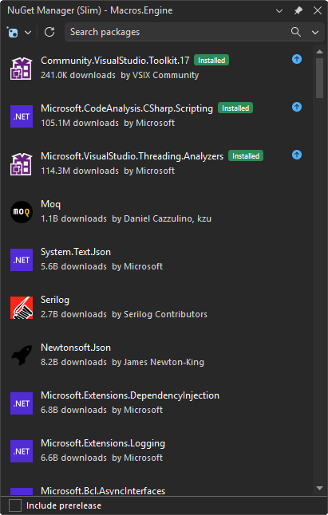
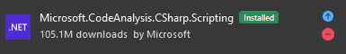
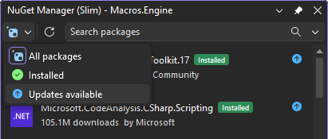
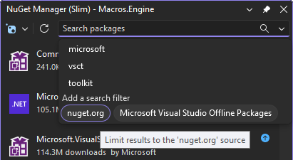
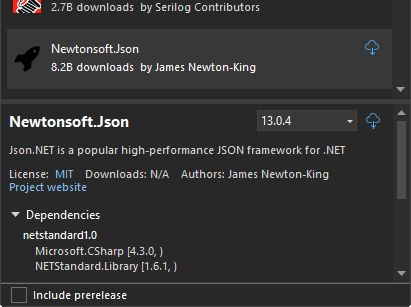

[marketplace]: <https://marketplace.visualstudio.com/items?itemName=MadsKristensen.NuGetManagerSlim>
[vsixgallery]: <http://vsixgallery.com/extension/NuGetManagerSlim.02b52d4a-302c-45d8-9d1f-9cc4759f30be/>
[repo]: <https://github.com/madskristensen/NuGetManagerSlim>

# NuGet Manager Slim for Visual Studio

**A faster, lighter NuGet Package Manager for Visual Studio.** One dockable tool window, one filterable list, no blocking dialogs.

Download from the [Visual Studio Marketplace][marketplace] or get the latest [CI build][vsixgallery].

---

## Why another NuGet manager?

The in-box Package Manager opens a large and somewhat heavy window, makes you flip between Browse / Installed / Updates tabs, and blocks the UI while it talks to the feed. NuGet Manager Slim replaces that flow with a single dockable tool window where every search, install, update, and uninstall runs asynchronously - the UI stays responsive the whole time.

It coexists with the built-in NuGet Package Manager. Both can be open at the same time and write to the same project files without conflict.

### How it compares

| Feature                           | Built-in Package Manager        | NuGet Manager Slim                     |
| --------------------------------- | ------------------------------- | -------------------------------------- |
| Browse / Installed / Updates      | Three separate tabs             | One unified, filterable list           |
| Installed packages while browsing | Hidden behind a tab             | Pinned at the top of the list          |
| Multiple operations               | Often serialized behind dialogs | Run independently per row              |
| Search                            | Blocks while loading            | Async, non-blocking, debounced         |
| Source filter                     | Dropdown at the top only        | Inline `source:"..."` filter chips     |
| Transitive packages               | Buried in dependency tree       | First-class section with "required by" |
| UI surface                        | Modal-style document window     | Dockable tool window                   |

## What Can You Do?

### One unified list

Installed packages pin to the top of the Browse list with a clear "Installed" badge, so you never have to flip tabs to see what's already there. Update arrows stay visible at rest, so outdated packages are obvious at a glance.

### Switch scope in a click

Toggle the view between **All packages**, **Installed**, and **Updates available** from the toolbar. The list re-renders instantly without re-querying the feed.

### Search that keeps up with you

As-you-type local filtering on already-loaded results, with debounced remote feed queries running in the background. The search box also doubles as a filter builder: pick a source from the dropdown to scope results to a specific feed without leaving the keyboard.

Useful filters:

- `source:"nuget.org"` - limit to a single feed
- `id:Newtonsoft` - match against the package id only
- Combine free text and filters: `serializer source:"nuget.org"`

### Inline actions

Install, update, and uninstall directly from the row. No dialog, no confirmation modal in the way - operations stream their progress in the status area while the rest of the list stays interactive.

### See your transitive dependencies

Indirect (transitive) packages appear under their own "Transitive packages" header in the Installed view, with a **required by** label so you know exactly which direct dependency pulled them in. They are read-only; to change a transitive version, update the direct dependency that requires it.

### Detail pane on demand

Click any package to reveal description, license, download count, authors, version history, project membership, dependencies, and a README preview - all without leaving the tool window.

The version dropdown lists every published version (stable by default, prerelease when toggled), and the dependency tree expands to show the full graph for the selected version.

## Get Started in 30 Seconds

1. **Install** from the [Visual Studio Marketplace][marketplace]
2. **Right-click** a project in Solution Explorer and pick **Manage NuGet Packages...**
3. **Search, browse, install** - the tool window stays interactive throughout

## Tips

| Action                                              | How                                                                           |
| --------------------------------------------------- | ----------------------------------------------------------------------------- |
| Filter to a specific feed                           | Type `source:"nuget.org"` in the search box, or pick from the filter dropdown |
| Match only the package id                           | Type `id:` followed by the partial id, e.g. `id:Serilog`                      |
| Toggle prerelease versions                          | The **Include prerelease** checkbox at the bottom                             |
| Switch between All / Installed / Updates            | The scope dropdown at the top of the tool window                              |
| See which package pulled in a transitive dependency | Look for the **required by** label under the package id                       |
| Clear cached feed results                           | Use the **Refresh** button in the toolbar                                     |
| Reopen the window after closing it                  | **View > Other Windows > NuGet Manager (Slim)**                               |

## FAQ

**Q: Does this replace the built-in NuGet Package Manager?**  
A: No. It runs alongside the in-box manager and uses the same NuGet client libraries under the hood, so package operations produce identical results. You can use either one (or both) on the same solution.

**Q: Where do my package sources come from?**  
A: From your existing NuGet configuration (`NuGet.config`). No separate setup. Authenticated and private feeds work the same way they do in the built-in manager.

**Q: Are packages.config projects supported?**  
A: Yes - both PackageReference (SDK-style) and packages.config projects are recognized for the installed list.

**Q: Why are some packages marked as transitive?**  
A: Transitive packages were pulled in by one of your direct dependencies, not added by you. They're shown for visibility (read-only) under the "Transitive packages" header. To change one, update the direct dependency that requires it.

**Q: A package shows no icon - is that a bug?**  
A: Some packages publish an `iconUrl` that resolves to nothing or to a non-image. The default placeholder is shown in those cases. Cached icons live in `%LocalAppData%\NuGetManagerSlim\IconCache`.

**Q: Does it work with multi-targeted projects?**  
A: Yes. The installed list reflects the union of packages across target frameworks, and version operations write to the project file the same way the built-in manager does.

**Q: Can I use it without a solution open?**  
A: The tool window opens, but most operations require an active project or solution to install or update against.

## Contributing

This is a passion project, and contributions are welcome.

- **Found a bug?** [Open an issue][repo]
- **Have an idea?** [Start a discussion][repo]
- **Want to contribute?** Pull requests are always welcome

**If NuGet Manager Slim saves you time**, consider:

- [Rating it on the Marketplace][marketplace]
- [Sponsoring on GitHub](https://github.com/sponsors/madskristensen)